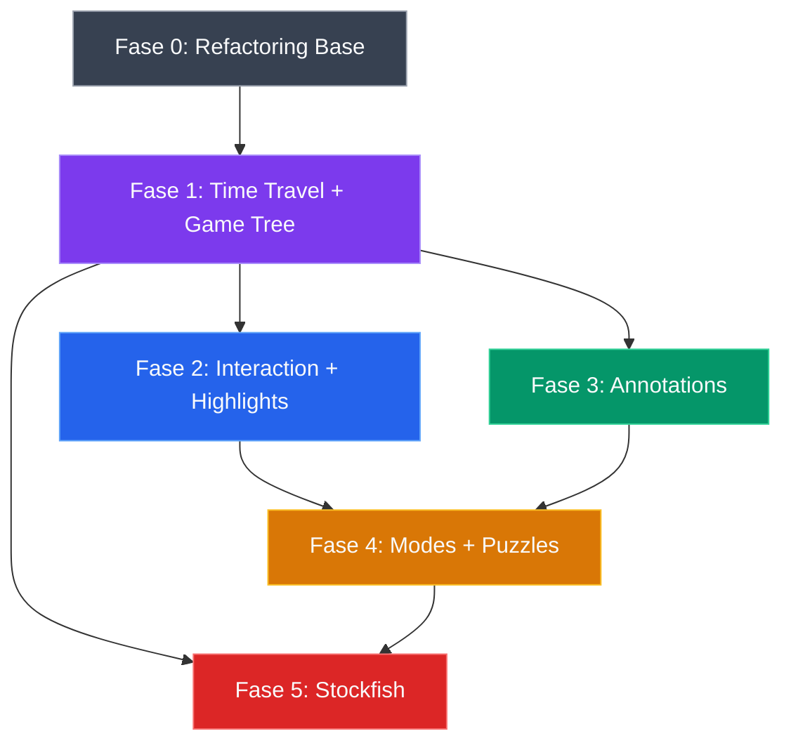

# 🏗️ Chess Framework — Plan de Implementación Definitivo

Transformar el motor de ajedrez actual de un "árbitro de juego" a un **Framework Multi-Contexto** de nivel plataforma, siguiendo las 5 fases del roadmap arquitectónico.

---

## 📊 Análisis de la Arquitectura Actual

### Lo que está BIEN hecho (base sólida)

| Patrón | Dónde se aplica | Veredicto |
|---|---|---|
| **Event-Driven Architecture** | [EventBus.ts](file:///Users/itsbrad/Documents/Javascript/chess/src/Core/EventBus.ts) — tipado con generics `AppEvents` | ✅ Excelente. El bus desacopla todo |
| **Headless/Agnostic** | [HeadlessBoard.ts](file:///Users/itsbrad/Documents/Javascript/chess/src/Core/HeadlessBoard.ts) — genera `SquareMetadata[][]` | ✅ Correcto. La UI es consumidora, no productora |
| **Domain Separation** | `Core/` vs `Managers/` vs `Types/` | ✅ Buen punto de partida |
| **Inyección de dependencias** | Todo se compone en [index.ts](file:///Users/itsbrad/Documents/Javascript/chess/src/index.ts) vía constructor | ✅ Limpio, testeable |
| **Tematización desacoplada** | [ThemeManager.ts](file:///Users/itsbrad/Documents/Javascript/chess/src/Managers/ThemeManager.ts) como "director de arte" | ✅ Buena abstracción |

### Lo que necesita EVOLUCIONAR

| Problema | Impacto | Solución |
|---|---|---|
| **Historial lineal** — No hay `undo()`, `redo()`, ni árbol de variantes | Bloquea análisis, puzzles, Stockfish | Game Tree con nodos |
| **No hay `lastMove` tracking** — El snapshot no sabe qué casillas iluminar | La UI no puede hacer highlights como chess.com | Metadata visual en snapshot |
| **No hay `selectedSquare`** — El motor no sabe qué pieza el usuario seleccionó | No se pueden mostrar destinos legales ("puntitos") | `InteractionManager` |
| **Modo único PLAY** — Todo pasa por `chess.js` strict validation | Imposible crear tableros libres, puzzles, análisis | `ModeManager` con PLAY/ANALYSIS/SETUP |
| **`EventBus` sin `off()`** — No se pueden desuscribir listeners | Memory leaks al destruir instancias | Agregar `off()` y `once()` |
| **No hay PGN import/export** — chess.js lo soporta pero no se expone | No se pueden cargar partidas históricas | Envolver `loadPgn()` / `pgn()` |
| **Promoción hardcoded a reina** — Línea 45 de [ChessEngine.ts](file:///Users/itsbrad/Documents/Javascript/chess/src/Core/ChessEngine.ts#L45) | Rota tácticamente, imposible para puzzles | Emitir evento `PROMOTION_REQUIRED` |
| **`HeadlessBoard` acoplado a `ThemeManager`** — El board no debería depender de temas | Viola SRP; dificulta uso server-side sin temas | Separar capas en el snapshot |

---

## 📁 Nueva Estructura de Directorios

```
src/
├── Core/
│   ├── ChessEngine.ts          [MODIFY] — Gestor multi-contexto, wrap completo de chess.js
│   ├── EventBus.ts             [MODIFY] — Agregar off(), once(), removeAll()
│   ├── HeadlessBoard.ts        [MODIFY] — Snapshot enriquecido con visuals layer
│   ├── GameTree.ts             [NEW]    — Árbol de nodos para variantes
│   ├── MoveNode.ts             [NEW]    — Nodo individual del Game Tree
│   └── ModeManager.ts          [NEW]    — PLAY | ANALYSIS | SETUP
│
├── Managers/
│   ├── AudioManager.ts         [MODIFY] — Nuevos eventos (castle, promotion, puzzle)
│   ├── ThemeManager.ts         [KEEP]   — Sin cambios significativos
│   ├── InteractionManager.ts   [NEW]    — Selección, legal moves, pre-moves
│   ├── AnnotationManager.ts    [NEW]    — Flechas, círculos, highlights custom
│   ├── HistoryManager.ts       [NEW]    — Undo/Redo, time travel, PGN navegación
│   └── PuzzleValidator.ts      [NEW]    — Validación de puzzles, oponente fantasma
│
├── Adapters/
│   └── StockfishAdapter.ts     [NEW]    — UCI protocol, Web Worker bridge
│
├── Types/
│   ├── index.ts                [MODIFY] — Barrel exports actualizados
│   ├── events.types.ts         [MODIFY] — Nuevos eventos del sistema
│   ├── theme.types.ts          [KEEP]   — Sin cambios
│   ├── board.types.ts          [NEW]    — SquareMetadata V2, Snapshot completo
│   ├── game-tree.types.ts      [NEW]    — MoveNode, GameTreeState
│   ├── mode.types.ts           [NEW]    — EngineMode, ModeConfig
│   ├── annotation.types.ts     [NEW]    — Arrow, Circle, Highlight
│   ├── puzzle.types.ts         [NEW]    — PuzzleConfig, PuzzleState
│   └── engine.types.ts         [NEW]    — UCIResponse, EvaluationData
│
├── index.ts                    [MODIFY] — API pública del framework
└── chess-console.ts            [MODIFY] — Demo actualizado
```

---

## User Review Required

> [!IMPORTANT]
> **Decisión: ¿Monorepo con packages?** La estructura actual es un paquete único. Con la adición de `StockfishAdapter` (que depende de Web Workers y es browser-only) y posiblemente un paquete `@chess/react` en el futuro, ¿prefieres mantener todo en un solo paquete por ahora y separar después, o comenzar con monorepo desde ya? **Mi recomendación: paquete único por ahora**, extraer en el futuro.

> [!IMPORTANT]  
> **Decisión: ¿Testing framework?** El proyecto no tiene tests. Para un framework de esta complejidad, necesitamos testing desde la Fase 1. **Mi recomendación: Vitest** (rápido, nativo de TypeScript, zero-config). Esto es crítico para la calidad del Game Tree.

> [!WARNING]
> **Breaking Change:** El `SquareMetadata` actual de [HeadlessBoard.ts](file:///Users/itsbrad/Documents/Javascript/chess/src/Core/HeadlessBoard.ts#L5-L14) va a cambiar. El snapshot se enriquece con `visuals`, `gameState`, y `evaluation`. Si alguien ya consume el snapshot actual, su código rompe. Como estamos en v1 y no hay consumidores externos, es el momento ideal.

---

## Open Questions

> [!IMPORTANT]
> **¿Prioridad de Pre-Moves?** Los pre-moves son una feature avanzada que requiere lógica de cola, validación post-turno, y manejo de conflictos. ¿Quieres que esté en la Fase 2 como lo indicó la conversación, o lo posponemos a una Fase 2.5 para entregar la Fase 2 core (highlights + selection) más rápido?

> [!IMPORTANT]
> **¿Stockfish WASM o la versión nativa?** La Fase 5 menciona Web Workers + UCI. Stockfish tiene una compilación oficial WASM (`stockfish.wasm`) que corre directo en el browser. Pero tu framework también podría correr en Node.js (server-side analysis). ¿Quieres que el `StockfishAdapter` soporte ambos entornos desde el inicio?

---

## Proposed Changes

### Fase 0: Refactoring de Infraestructura (Cimientos)

Antes de construir, necesitamos reforzar la base. Esto no agrega features, pero hace posible todo lo demás.

---

#### [MODIFY] [EventBus.ts](file:///Users/itsbrad/Documents/Javascript/chess/src/Core/EventBus.ts)

Agregar métodos `off()`, `once()`, y `removeAllListeners()`. Actualmente no hay forma de desuscribirse, lo cual causa memory leaks si se destruyen componentes.

```typescript
// Nuevos métodos:
off<K>(event: K, callback): void     // Desuscribir listener específico
once<K>(event: K, callback): void    // Escuchar solo una vez
removeAllListeners(event?: K): void  // Limpiar todo
```

---

#### [NEW] [board.types.ts](file:///Users/itsbrad/Documents/Javascript/chess/src/Types/board.types.ts)

Extraer y evolucionar `SquareMetadata` fuera de `HeadlessBoard.ts` hacia su propio archivo de tipos. El nuevo snapshot tendrá esta forma:

```typescript
export interface BoardSnapshot {
  gameState: {
    turn: 'w' | 'b';
    inCheck: boolean;
    isCheckmate: boolean;
    isStalemate: boolean;
    isDraw: boolean;
    isGameOver: boolean;
    moveNumber: number;
    fen: string;
    mode: EngineMode;               // PLAY | ANALYSIS | SETUP
    evaluation?: EvaluationData;     // Inyectado por Stockfish (fase 5)
  };
  board: SquareData[][];             // Renamed de SquareMetadata
  visuals: {
    lastMove: { from: string; to: string } | null;
    selectedSquare: string | null;
    validDestinations: string[];     // Para los "puntitos"
    premoves: { from: string; to: string }[];
    annotations: Annotation[];       // Flechas, círculos
  };
  history: {
    canUndo: boolean;
    canRedo: boolean;
    moveCount: number;
    currentIndex: number;            // Posición en el Game Tree
    hasVariations: boolean;          // Si hay ramas alternativas
  };
}
```

---

#### [MODIFY] [events.types.ts](file:///Users/itsbrad/Documents/Javascript/chess/src/Types/events.types.ts)

Expandir drásticamente el mapa de eventos del sistema:

```typescript
export type AppEvents = {
  // === Existentes (mantener) ===
  'PIECE_MOVED': MovePayload;
  'PIECE_CAPTURED': CapturePayload;
  'CHECK': { kingColor: 'w' | 'b' };
  'GAME_OVER': { winner: 'w' | 'b' | 'draw'; reason: string };
  'THEME_CHANGED': { themeId: string; themeName: string };

  // === Fase 1: Time Travel ===
  'MOVE_UNDONE': { move: MovePayload };
  'MOVE_REDONE': { move: MovePayload };
  'POSITION_LOADED': { fen: string; source: 'fen' | 'pgn' };
  'GAME_RESET': {};
  'NAVIGATE_TO_MOVE': { moveIndex: number };

  // === Fase 1: Castling & Promotion ===
  'CASTLED': { side: 'kingside' | 'queenside'; color: 'w' | 'b' };
  'PROMOTION_REQUIRED': { from: string; to: string; color: 'w' | 'b' };
  'PROMOTED': { square: string; piece: PieceSymbol };

  // === Fase 2: Interaction ===
  'SQUARE_SELECTED': { square: string; legalMoves: string[] };
  'SQUARE_DESELECTED': {};
  'PREMOVE_QUEUED': { from: string; to: string };
  'PREMOVE_EXECUTED': { from: string; to: string };
  'PREMOVE_CANCELLED': {};

  // === Fase 3: Annotations ===
  'ANNOTATION_ADDED': { annotation: Annotation };
  'ANNOTATION_REMOVED': { id: string };
  'ANNOTATIONS_CLEARED': {};

  // === Fase 4: Modes & Puzzles ===
  'MODE_CHANGED': { from: EngineMode; to: EngineMode };
  'PIECE_PLACED': { square: string; piece: PieceSymbol; color: Color };
  'PIECE_REMOVED': { square: string };
  'PUZZLE_STARTED': { fen: string; movesRequired: number };
  'PUZZLE_CORRECT_MOVE': { move: string; remaining: number };
  'PUZZLE_FAILED': { expected: string; actual: string };
  'PUZZLE_COMPLETED': { totalMoves: number };

  // === Fase 5: Engine ===
  'EVALUATION_UPDATED': { evaluation: EvaluationData };
  'BEST_MOVE': { move: string; ponder?: string };
  'ENGINE_READY': {};
  'ENGINE_ERROR': { error: string };

  // === Fase 2: Game Tree ===
  'VARIATION_CREATED': { parentNodeId: string; moveIndex: number };
  'VARIATION_SELECTED': { nodeId: string };

  // === General ===
  'BOARD_UPDATED': {};
};
```

---

### Fase 1: La Máquina del Tiempo (Historial, FEN, PGN, Game Tree)

Esta es la fase más crítica. Transforma el motor de lineal a multidimensional.

---

#### [NEW] [MoveNode.ts](file:///Users/itsbrad/Documents/Javascript/chess/src/Core/MoveNode.ts)

La unidad atómica del Game Tree. Cada nodo almacena un "momento" completo:

```typescript
export class MoveNode {
  readonly id: string;                    // UUID único
  readonly fen: string;                   // Fotografía exacta del estado
  readonly move: MoveData | null;         // El movimiento que llevó aquí (null = root)
  readonly parent: MoveNode | null;       // Referencia al nodo padre
  readonly children: MoveNode[];          // Ramas/variantes
  readonly comment: string;               // Anotación textual
  readonly moveNumber: number;            // Número de jugada
  readonly halfMoveIndex: number;         // Índice en semijugadas desde root

  addChild(node: MoveNode): void;
  getMainLine(): MoveNode;               // Hijo[0] = línea principal
  getVariations(): MoveNode[];           // Hijo[1..n] = alternativas
  isMainLine(): boolean;                 // ¿Es la línea principal?
}
```

---

#### [NEW] [GameTree.ts](file:///Users/itsbrad/Documents/Javascript/chess/src/Core/GameTree.ts)

El Gestor del Multiverso. Mantiene el árbol completo y permite navegar entre universos:

```typescript
export class GameTree {
  private root: MoveNode;                // Nodo raíz (posición inicial)
  private currentNode: MoveNode;         // "Puntero" al nodo actual
  
  // === Navegación ===
  goToNext(): MoveNode | null;           // Avanzar por línea principal
  goToPrev(): MoveNode | null;           // Retroceder al padre
  goToRoot(): MoveNode;                  // Inicio de la partida
  goToEnd(): MoveNode;                   // Último movimiento de la línea principal
  goToNode(nodeId: string): MoveNode;    // Saltar a nodo específico

  // === Mutación ===
  addMove(fen: string, move: MoveData): MoveNode;   // Agrega hijo al nodo actual
  // Si el nodo actual ya tiene un hijo con ese movimiento, navega ahí.
  // Si no, crea nueva variante.

  // === Serialización ===
  toMainLinePgn(): string;               // Exportar línea principal
  toFullPgn(): string;                   // Exportar con variantes (RAV notation)
  fromPgn(pgn: string): void;            // Importar PGN completo
  
  // === Consulta ===
  getMainLine(): MoveNode[];             // Secuencia root → end
  getVariationsAt(nodeId: string): MoveNode[];  // Ramas alternativas
  getPathToNode(nodeId: string): MoveNode[];    // Camino desde root
}
```

---

#### [MODIFY] [ChessEngine.ts](file:///Users/itsbrad/Documents/Javascript/chess/src/Core/ChessEngine.ts)

**Refactoring mayor.** El engine se convierte en el orquestador central. Ya no solo valida movimientos, ahora gestiona estado completo:

**Cambios clave:**
1. Integrar `GameTree` internamente para todo el tracking de historial
2. Exponer `loadFen(fen)`, `loadPgn(pgn)` wrapeando `chess.js`
3. Implementar `undo()` / `redo()` usando el Game Tree (no el undo de chess.js, ya que chess.js no tiene redo)
4. Emitir `CASTLED` cuando detecte enroque en `analyzeAndEmitEvents()`
5. Resolver la promoción: emitir `PROMOTION_REQUIRED` si un peón llega a la última fila, esperar respuesta vía `resolvePromotion(piece)`
6. Tracking de `lastMove` para que el snapshot sepa qué casillas iluminar
7. Exponer `getTurn()`, `getMoveNumber()`, `getHistory()`, `getPgn()`, `isGameOver()` con razones detalladas

---

#### [NEW] [HistoryManager.ts](file:///Users/itsbrad/Documents/Javascript/chess/src/Managers/HistoryManager.ts)

Capa de conveniencia sobre el `GameTree` para operaciones de alto nivel:

```typescript
export class HistoryManager {
  // Time Travel API (lo que la UI llama)
  undo(): boolean;
  redo(): boolean;
  goToMove(index: number): boolean;
  goToStart(): void;
  goToEnd(): void;
  
  // Serialización
  exportPgn(): string;
  importPgn(pgn: string): void;
  exportFen(): string;
  importFen(fen: string): void;
  
  // Consultas
  canUndo(): boolean;
  canRedo(): boolean;
  getMoveList(): MoveData[];
  getCurrentMoveIndex(): number;
}
```

---

### Fase 2: Capa Visual Superior (Interaction, Highlights, Pre-Moves)

---

#### [NEW] [InteractionManager.ts](file:///Users/itsbrad/Documents/Javascript/chess/src/Managers/InteractionManager.ts)

El puente entre el input del usuario y la lógica del motor:

```typescript
export class InteractionManager {
  private selectedSquare: string | null;
  private legalMovesCache: string[];
  private premoveQueue: PremoveData[];

  // === Selección ===
  selectSquare(square: string): void;
  // Si hay pieza del turno actual → selecciona, calcula legales, emite SQUARE_SELECTED
  // Si ya hay selección y square es destino legal → ejecuta movimiento
  // Si es pieza propia diferente → reselecciona
  
  deselectSquare(): void;

  // === Pre-Moves ===
  queuePremove(from: string, to: string): void;
  cancelPremoves(): void;
  executePendingPremove(): boolean;   // Llamado automáticamente tras movimiento enemigo
  
  // === Data para Snapshot ===
  getSelectedSquare(): string | null;
  getValidDestinations(): string[];
  getPremoves(): PremoveData[];
}
```

---

#### [MODIFY] [HeadlessBoard.ts](file:///Users/itsbrad/Documents/Javascript/chess/src/Core/HeadlessBoard.ts)

**Evolución del snapshot.** En lugar de solo devolver la cuadrícula, devuelve el `BoardSnapshot` completo con todas las capas:

**Cambios clave:**
1. `getBoardSnapshot()` ahora retorna `BoardSnapshot` (el objeto gordo del futuro)
2. La cuadrícula incluye `isLastMoveOrigin`, `isLastMoveDestination`, `isSelected`, `isValidDestination`, `isPremoveOrigin`, `isPremoveDestination`
3. Separar la lógica de theme resolution: el `HeadlessBoard` produce data pura, el `ThemeManager` se aplica opcionalmente
4. Renombrar `handleExternalInteraction()` a `handleMove()` (más semántico)
5. Agregar `handleSquareClick(square)` que delega al `InteractionManager`

---

#### [MODIFY] [AudioManager.ts](file:///Users/itsbrad/Documents/Javascript/chess/src/Managers/AudioManager.ts)

Suscribirse a los nuevos eventos:

```typescript
// Nuevos sonidos
'CASTLED'             → playSound('castle')
'PROMOTED'            → playSound('promote')
'PUZZLE_CORRECT_MOVE' → playSound('correct')  
'PUZZLE_FAILED'       → playSound('incorrect')
'PUZZLE_COMPLETED'    → playSound('victory')
```

---

### Fase 3: Overlay Manager (Anotaciones Geométricas)

---

#### [NEW] [annotation.types.ts](file:///Users/itsbrad/Documents/Javascript/chess/src/Types/annotation.types.ts)

```typescript
export type AnnotationType = 'arrow' | 'circle' | 'highlight';
export type AnnotationColor = 'green' | 'red' | 'blue' | 'yellow' | string;

export interface Annotation {
  id: string;                     // UUID
  type: AnnotationType;
  color: AnnotationColor;
}

export interface ArrowAnnotation extends Annotation {
  type: 'arrow';
  from: string;                   // Casilla origen (ej: 'g1')
  to: string;                     // Casilla destino (ej: 'f3')
}

export interface CircleAnnotation extends Annotation {
  type: 'circle';
  square: string;                 // Casilla marcada
}

export interface HighlightAnnotation extends Annotation {
  type: 'highlight';
  square: string;
  backgroundColor: string;       // Color custom de fondo
}
```

---

#### [NEW] [AnnotationManager.ts](file:///Users/itsbrad/Documents/Javascript/chess/src/Managers/AnnotationManager.ts)

Totalmente independiente de la lógica del juego. Es una capa de "pintura":

```typescript
export class AnnotationManager {
  private annotations: Map<string, Annotation>;

  addArrow(from: string, to: string, color: AnnotationColor): string;
  addCircle(square: string, color: AnnotationColor): string;
  addHighlight(square: string, color: string): string;
  
  removeAnnotation(id: string): boolean;
  clearAll(): void;
  clearByType(type: AnnotationType): void;
  
  // Toggle: si ya existe flecha de A→B, la quita; si no, la crea
  toggleArrow(from: string, to: string, color: AnnotationColor): void;
  toggleCircle(square: string, color: AnnotationColor): void;
  
  getAnnotations(): Annotation[];
  getAnnotationsForSquare(square: string): Annotation[];
}
```

---

### Fase 4: Modo Creador (Sandboxing y Puzzles)

---

#### [NEW] [mode.types.ts](file:///Users/itsbrad/Documents/Javascript/chess/src/Types/mode.types.ts)

```typescript
export type EngineMode = 'PLAY' | 'ANALYSIS' | 'SETUP';

export interface ModeConfig {
  PLAY: {
    enforceRules: true;
    allowBothColors: false;
    allowUndo: boolean;         // Configurable
  };
  ANALYSIS: {
    enforceRules: true;         // Las reglas aplican pero sin restricción de turno
    allowBothColors: true;
    allowUndo: true;
    allowVariations: true;
  };
  SETUP: {
    enforceRules: false;        // chess.js bypassed
    allowFreePlacement: true;
    pieceBankEnabled: true;     // Banco de piezas virtual
  };
}
```

---

#### [NEW] [ModeManager.ts](file:///Users/itsbrad/Documents/Javascript/chess/src/Core/ModeManager.ts)

Controla las reglas de juego según el contexto:

```typescript
export class ModeManager {
  private currentMode: EngineMode;
  
  setMode(mode: EngineMode): void;
  getMode(): EngineMode;

  // Preguntas de policy
  shouldValidateMove(): boolean;      // PLAY: sí, ANALYSIS: parcial, SETUP: no
  canMoveBothColors(): boolean;       // PLAY: no, ANALYSIS/SETUP: sí
  canUndoRedo(): boolean;            
  canBranch(): boolean;               // Solo en ANALYSIS
  canPlaceFreely(): boolean;          // Solo en SETUP
}
```

---

#### [NEW] [puzzle.types.ts](file:///Users/itsbrad/Documents/Javascript/chess/src/Types/puzzle.types.ts)

```typescript
export interface PuzzleConfig {
  id: string;
  fen: string;                          // Posición inicial
  solution: string[];                    // Movimientos correctos en SAN ['Qh7+', 'Kf8', 'Qh8#']
  playerColor: 'w' | 'b';              // ¿Qué color juega el humano?
  rating?: number;
  themes?: string[];                     // ['mate-in-2', 'sacrifice', 'pin']
}

export interface PuzzleState {
  status: 'ACTIVE' | 'COMPLETED' | 'FAILED';
  currentStepIndex: number;             // Posición en el array solution
  playerMoves: string[];                // Lo que el humano ha jugado
  opponentAutoMoves: string[];          // Respuestas automáticas del oponente fantasma
}
```

---

#### [NEW] [PuzzleValidator.ts](file:///Users/itsbrad/Documents/Javascript/chess/src/Managers/PuzzleValidator.ts)

El cerebro de los puzzles:

```typescript
export class PuzzleValidator {
  private config: PuzzleConfig | null;
  private state: PuzzleState;

  loadPuzzle(config: PuzzleConfig): void;
  
  // Intercepta un movimiento del jugador
  validatePlayerMove(move: string): 'correct' | 'incorrect';
  
  // Tras un movimiento correcto, el oponente responde automáticamente
  getOpponentResponse(): string | null;
  
  // Estado actual
  isActive(): boolean;
  isComplete(): boolean;
  getProgress(): { current: number; total: number };
  
  reset(): void;
}
```

---

### Fase 5: El Oráculo (Stockfish WebWorker + UCI)

---

#### [NEW] [engine.types.ts](file:///Users/itsbrad/Documents/Javascript/chess/src/Types/engine.types.ts)

```typescript
export interface EvaluationData {
  score: number;                         // En centipawns (positivo = ventaja blancas)
  mate: number | null;                   // Mate en N jugadas (null si no hay mate forzado)
  depth: number;                         // Profundidad del análisis
  bestMove: string;                      // Mejor movimiento en UCI notation
  ponder: string | null;                 // Respuesta esperada del oponente
  pv: string[];                          // Principal variation (secuencia de mejores movimientos)
  nodes: number;                         // Nodos evaluados
  time: number;                          // Tiempo de cálculo en ms
}

export interface StockfishConfig {
  wasmPath?: string;                     // Ruta al .wasm
  workerPath?: string;                   // Ruta al worker.js
  defaultDepth: number;                  // Profundidad por defecto (ej: 18)
  multiPV?: number;                      // Número de líneas a evaluar
  threads?: number;                      // Hilos (para WASM multithreaded)
  hashSize?: number;                     // MB para hash table
}
```

---

#### [NEW] [StockfishAdapter.ts](file:///Users/itsbrad/Documents/Javascript/chess/src/Adapters/StockfishAdapter.ts)

Proxy entre el motor y Stockfish vía UCI protocol:

```typescript
export class StockfishAdapter {
  private worker: Worker | null;
  private isReady: boolean;

  // === Lifecycle ===
  init(config: StockfishConfig): Promise<void>;
  destroy(): void;
  isInitialized(): boolean;

  // === Analysis ===
  evaluate(fen: string, depth?: number): Promise<EvaluationData>;
  evaluateMultiPV(fen: string, lines?: number): Promise<EvaluationData[]>;
  getBestMove(fen: string, depth?: number): Promise<string>;
  
  // === Control ===
  stop(): void;                          // Detener análisis en curso
  setOption(name: string, value: string | number): void;

  // === UCI Raw ===
  sendCommand(cmd: string): void;
  onMessage(handler: (msg: string) => void): void;
}
```

---

## 🗓️ Orden de Ejecución (Dependencias)



---

## Verification Plan

### Automated Tests

Cada fase incluirá tests unitarios con **Vitest**:

```bash
# Correr todos los tests
pnpm test

# Tests por fase
pnpm test -- --grep "GameTree"
pnpm test -- --grep "ModeManager"
pnpm test -- --grep "PuzzleValidator"
```

**Tests críticos Fase 1:**
- Game Tree: crear nodos, navegar, ramificar, serializar a PGN
- FEN: load/export round-trip (cargar un FEN → export → debe ser idéntico)
- PGN: load partida famosa → navegar → export → debe ser idéntico
- Undo/Redo: 10 movimientos → undo 5 → redo 3 → estado consistente
- Promoción: peón en séptima → mover a octava → evento `PROMOTION_REQUIRED`

**Tests críticos Fase 2:**
- Selección: click en pieza → legal moves calculados correctamente
- Pre-moves: queue premove → turno cambia → premove se ejecuta o invalida

**Tests críticos Fase 4:**
- Modo SETUP: colocar piezas ilegales → no crash, FEN exportable
- Puzzle: secuencia correcta → `PUZZLE_COMPLETED`, movimiento malo → `PUZZLE_FAILED`

### Manual Verification
- El demo `chess-console.ts` se actualizará para ejercitar cada fase
- El usuario podrá probar `undo`/`redo`, cargar FENs, y ver el snapshot enriquecido en consola
