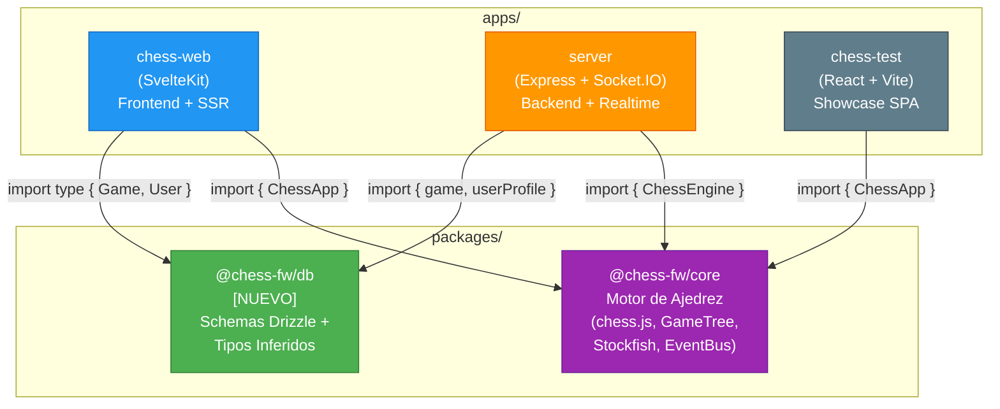
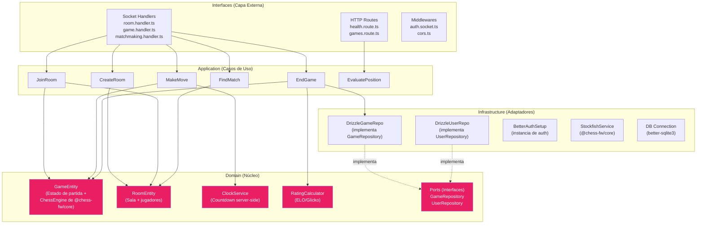
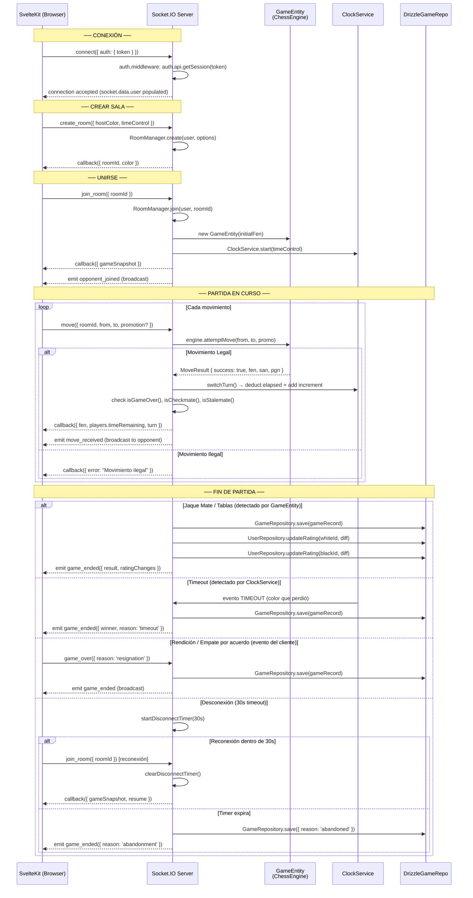
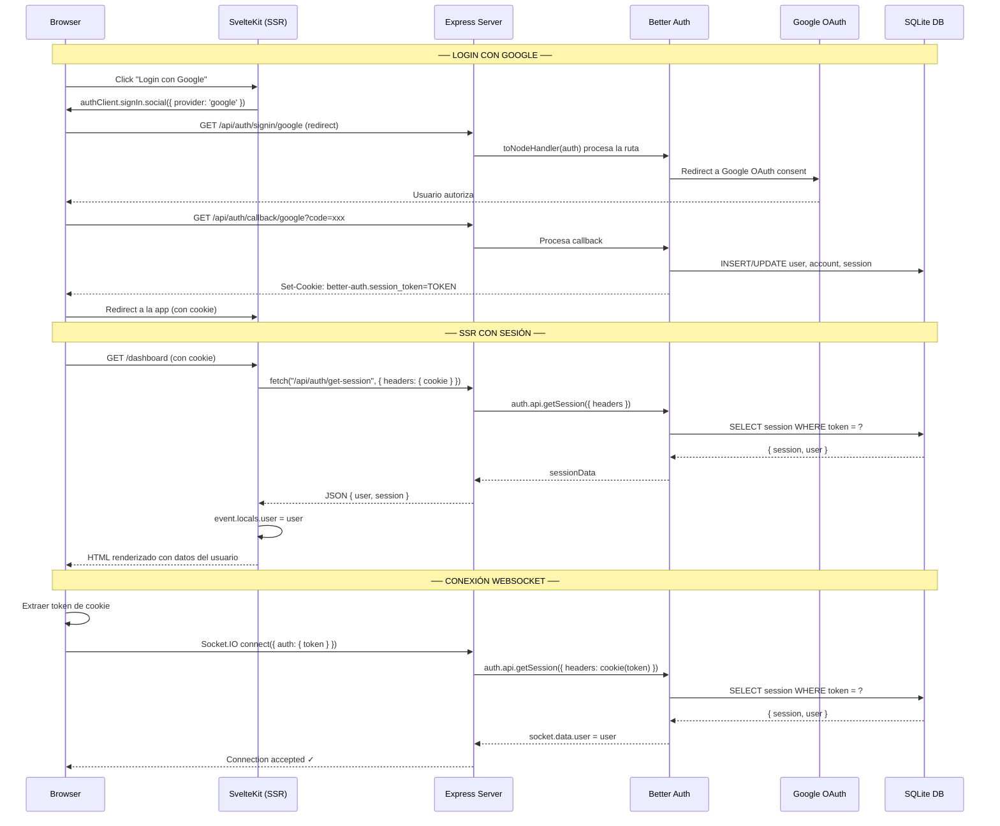

# Plan Maestro: Arquitectura del Servidor de Ajedrez Online

## Tabla de Contenidos
1. [Estructura del Monorepo y Clean Architecture](#1-estructura-del-monorepo-y-clean-architecture)
2. [Modelado de Base de Datos (Inspiración Lichess)](#2-modelado-de-base-de-datos-inspiración-lichess)
3. [Arquitectura Event-Driven (Partidas Online)](#3-arquitectura-event-driven-partidas-online)
4. [Autenticación (Better Auth + Express)](#4-autenticación-better-auth--express)
5. [Fases de Desarrollo](#5-fases-de-desarrollo)

---

## 1. Estructura del Monorepo y Clean Architecture

### 1.1 Diagrama de Dependencias del Monorepo


```mermaid
graph TB
    subgraph "apps/"
        CW["chess-web<br/>(SvelteKit)<br/>Frontend + SSR"]
        SRV["server<br/>(Express + Socket.IO)<br/>Backend + Realtime"]
        CT["chess-test<br/>(React + Vite)<br/>Showcase SPA"]
    end

    subgraph "packages/"
        CORE["@chess-fw/core<br/>Motor de Ajedrez<br/>(chess.js, GameTree,<br/>Stockfish, EventBus)"]
        DB["@chess-fw/db<br/>[NUEVO]<br/>Schemas Drizzle +<br/>Tipos Inferidos"]
    end

    CW -->|"import type { Game, User }"| DB
    CW -->|"import { ChessApp }"| CORE
    SRV -->|"import { game, userProfile }"| DB
    SRV -->|"import { ChessEngine }"| CORE
    CT -->|"import { ChessApp }"| CORE

    style DB fill:#4CAF50,color:#fff,stroke:#2E7D32
    style SRV fill:#FF9800,color:#fff,stroke:#E65100
    style CW fill:#2196F3,color:#fff,stroke:#1565C0
    style CORE fill:#9C27B0,color:#fff,stroke:#6A1B9A
    style CT fill:#607D8B,color:#fff,stroke:#37474F
```

### 1.2 Responsabilidades de cada Nodo

| Nodo | Responsabilidad | Lo que NO hace |
|---|---|---|
| **`apps/server`** | Auth (Better Auth), DB (Drizzle + better-sqlite3), WebSockets, Clock Authority, Validación de Movimientos, Persistencia de Partidas, Rating ELO | Renderizar vistas, servir HTML |
| **`apps/chess-web`** | SSR, UI/UX, Renderizado del tablero, Interacción local, Consumir API de auth del server | Conectarse a DB, manejar auth OAuth, validar movimientos de partidas online |
| **`packages/db`** | Exportar Schemas de Drizzle (tablas) y tipos TypeScript inferidos (`Game`, `User`, `UserProfile`, etc.) | Instanciar conexiones DB, importar `better-sqlite3` |
| **`packages/core`** | Motor de ajedrez headless: validación de movimientos, GameTree, PGN/FEN, Stockfish, EventBus | Persistencia, autenticación, red |

### 1.3 El Paquete `packages/db` — Anatomía

> [!IMPORTANT]
> **Principio Fundamental:** Este paquete exporta **definiciones de tablas** (que son objetos JavaScript puros de `drizzle-orm/sqlite-core`) y **tipos inferidos**. La dependencia `drizzle-orm` es JavaScript puro y funciona en cualquier runtime (Node, Edge, Browser). El paquete **NUNCA** importa `better-sqlite3` (el driver nativo). La conexión física a la base de datos se crea **únicamente** en `apps/server`.

```text
packages/db/
├── src/
│   ├── schema/
│   │   ├── auth.schema.ts      # Tablas de Better Auth (user, session, account, verification)
│   │   ├── game.schema.ts      # [NUEVO] Tablas de partidas (game, game_clock)
│   │   ├── social.schema.ts    # [NUEVO] Tablas sociales (user_profile, friendship)
│   │   └── index.ts            # Re-exporta todos los schemas
│   │
│   ├── types.ts                # Tipos inferidos: export type Game = typeof game.$inferSelect
│   ├── relations.ts            # Relaciones Drizzle entre tablas
│   └── index.ts                # Barrel: exporta schemas, tipos y relaciones
│
├── drizzle.config.ts           # Config de migraciones (apunta a DB del server)
├── package.json                # deps: drizzle-orm (SOLO este, sin drivers nativos)
└── tsconfig.json
```

**Consumo desde SvelteKit (Edge-safe):**
```typescript
// apps/chess-web/src/routes/(app)/history/+page.svelte
import type { Game, UserProfile } from '@chess-fw/db/types';

// El fetch retorna datos tipados. Cero "any".
const res = await fetch('http://localhost:3001/api/games/mine');
const games: Game[] = await res.json();
```

**Consumo desde Express (Node.js runtime):**
```typescript
// apps/server/src/infrastructure/db/connection.ts
import Database from 'better-sqlite3';                // Driver nativo: SOLO aquí
import { drizzle } from 'drizzle-orm/better-sqlite3'; // SOLO aquí
import * as schema from '@chess-fw/db';                // Schemas puros (sin driver)

const client = new Database(process.env.DATABASE_URL!);
export const db = drizzle(client, { schema });
```

### 1.4 Clean Architecture del Server (`apps/server`)


```mermaid
graph TB
    subgraph "Interfaces (Capa Externa)"
        direction TB
        SH["Socket Handlers<br/>room.handler.ts<br/>game.handler.ts<br/>matchmaking.handler.ts"]
        HR["HTTP Routes<br/>health.route.ts<br/>games.route.ts"]
        MW["Middlewares<br/>auth.socket.ts<br/>cors.ts"]
    end

    subgraph "Application (Casos de Uso)"
        direction TB
        CR["CreateRoom"]
        JR["JoinRoom"]
        MM["MakeMove"]
        EG["EndGame"]
        FM["FindMatch"]
        EP["EvaluatePosition"]
    end

    subgraph "Domain (Núcleo)"
        direction TB
        GE["GameEntity<br/>(Estado de partida +<br/>ChessEngine de @chess-fw/core)"]
        RE["RoomEntity<br/>(Sala + jugadores)"]
        CL["ClockService<br/>(Countdown server-side)"]
        RT["RatingCalculator<br/>(ELO/Glicko)"]
        RP["Ports (Interfaces)<br/>GameRepository<br/>UserRepository"]
    end

    subgraph "Infrastructure (Adaptadores)"
        direction TB
        DG["DrizzleGameRepo<br/>(implementa GameRepository)"]
        DU["DrizzleUserRepo<br/>(implementa UserRepository)"]
        BA["BetterAuthSetup<br/>(instancia de auth)"]
        SF["StockfishService<br/>(@chess-fw/core)"]
        DC["DB Connection<br/>(better-sqlite3)"]
    end

    SH --> CR
    SH --> JR
    SH --> MM
    SH --> EG
    SH --> FM
    HR --> EP

    CR --> RE
    JR --> RE
    JR --> GE
    MM --> GE
    MM --> CL
    EG --> GE
    EG --> DG
    EG --> RT
    FM --> RE

    DG -.->|implementa| RP
    DU -.->|implementa| RP

    style GE fill:#E91E63,color:#fff
    style RE fill:#E91E63,color:#fff
    style CL fill:#E91E63,color:#fff
    style RT fill:#E91E63,color:#fff
    style RP fill:#E91E63,color:#fff
```

### 1.5 Estructura de Carpetas del Server

```text
apps/server/
├── src/
│   ├── domain/                         # Capa Interna: Lógica de negocio pura
│   │   ├── entities/
│   │   │   ├── GameEntity.ts           # Envuelve ChessEngine de @chess-fw/core
│   │   │   │                           # Valida movimientos server-side
│   │   │   │                           # Mantiene FEN/PGN autoritativo
│   │   │   └── RoomEntity.ts           # Sala: jugadores, estado, timeControl
│   │   │
│   │   ├── services/
│   │   │   ├── ClockService.ts         # Deducción de tiempo, incremento,
│   │   │   │                           # detección timeout server-side
│   │   │   ├── RatingCalculator.ts     # Fórmula ELO (K-factor dinámico)
│   │   │   └── RoomManager.ts         # Map<roomId, Room> en memoria
│   │   │                               # Garbage collector de salas
│   │   │
│   │   └── ports/                      # Interfaces (contratos)
│   │       ├── GameRepository.port.ts  # save(game), findByUser(userId), findById(id)
│   │       └── UserRepository.port.ts  # getProfile(userId), updateRating(userId, delta)
│   │
│   ├── application/                    # Casos de Uso (Orquestadores)
│   │   ├── CreateRoom.usecase.ts
│   │   ├── JoinRoom.usecase.ts
│   │   ├── MakeMove.usecase.ts
│   │   ├── EndGame.usecase.ts          # Persiste partida, calcula ELO
│   │   ├── Rematch.usecase.ts
│   │   ├── FindMatch.usecase.ts        # Matchmaking por rating/speed
│   │   └── EvaluatePosition.usecase.ts # Stockfish bot moves
│   │
│   ├── infrastructure/                 # Adaptadores externos
│   │   ├── db/
│   │   │   └── connection.ts           # better-sqlite3 + drizzle instance
│   │   ├── repositories/
│   │   │   ├── DrizzleGameRepository.ts
│   │   │   └── DrizzleUserRepository.ts
│   │   ├── auth/
│   │   │   └── setup.ts               # betterAuth({ database: drizzleAdapter(db) })
│   │   └── stockfish/
│   │       └── StockfishService.ts     # Wrapper de @chess-fw/core StockfishAdapter
│   │
│   ├── interfaces/                     # Controladores / Entry Points
│   │   ├── socket/
│   │   │   ├── auth.middleware.ts      # Valida token en handshake
│   │   │   ├── room.handler.ts         # create_room, join_room
│   │   │   ├── game.handler.ts         # move, game_over
│   │   │   ├── rematch.handler.ts      # request/accept/decline rematch
│   │   │   └── matchmaking.handler.ts  # find_match, cancel_search
│   │   └── http/
│   │       ├── auth.route.ts           # app.all("/api/auth/*", toNodeHandler(auth))
│   │       ├── games.route.ts          # GET /api/games/:id, GET /api/games/user/:userId
│   │       └── health.route.ts         # GET /api/health
│   │
│   ├── config/
│   │   ├── env.ts                      # Validación de variables de entorno
│   │   ├── constants.ts                # DISCONNECT_TIMEOUT, GC_INTERVAL, etc.
│   │   └── cors.ts                     # CORS config con credentials: true
│   │
│   └── index.ts                        # Bootstrap: ~50 líneas max
│                                       # Crea Express, HTTP, Socket.IO
│                                       # Registra middlewares y handlers
│                                       # Llama listen()
│
├── bin/                                # Binarios Stockfish (existente)
├── package.json
└── tsconfig.json
```

> [!TIP]
> **¿Por qué `GameEntity` envuelve `ChessEngine` de `@chess-fw/core`?**
> Actualmente el servidor **confía ciegamente** en el FEN que envía el cliente (línea 383 del index.ts actual: `room.fen = fen`). Esto es un agujero de seguridad enorme: un cliente malicioso podría enviar cualquier FEN. Con `GameEntity`, cada sala tendrá su propia instancia de `ChessEngine` que valida la legalidad de cada movimiento server-side. El FEN autoritativo es el que calcula el servidor, no el que envía el cliente.

---

## 2. Modelado de Base de Datos (Inspiración Lichess)

### 2.1 Diagrama Entidad-Relación

```mermaid
erDiagram
    USER ||--o{ SESSION : has
    USER ||--o{ ACCOUNT : has
    USER ||--|| USER_PROFILE : has
    USER ||--o{ GAME : "plays as white"
    USER ||--o{ GAME : "plays as black"
    USER ||--o{ FRIENDSHIP : "requester"
    USER ||--o{ FRIENDSHIP : "addressee"

    USER {
        text id PK
        text name
        text email UK
        integer email_verified
        text image
        integer created_at
        integer updated_at
    }

    USER_PROFILE {
        text user_id PK_FK
        text username UK
        text bio
        text country
        integer rating_bullet
        integer rating_blitz
        integer rating_rapid
        integer rating_classical
        integer games_played
        integer wins
        integer losses
        integer draws
        integer last_seen_at
    }

    GAME {
        text id PK
        text white_id FK
        text black_id FK
        text status
        text winner
        text termination
        integer time_initial
        integer time_increment
        text speed
        text initial_fen
        text moves
        text pgn
        integer half_moves
        text eco
        text opening_name
        integer white_rating
        integer black_rating
        integer white_rating_diff
        integer black_rating_diff
        text clocks
        integer rated
        text variant
        text source
        integer created_at
        integer started_at
        integer finished_at
    }

    FRIENDSHIP {
        text id PK
        text requester_id FK
        text addressee_id FK
        text status
        integer created_at
        integer updated_at
    }

    SESSION {
        text id PK
        text token UK
        text user_id FK
        integer expires_at
    }

    ACCOUNT {
        text id PK
        text provider_id
        text user_id FK
    }
```

### 2.2 Tabla `game` — Detalle de Campos

Diseñada para reconstruir un PGN estándar completo incluyendo todas las cabeceras FIDE.

| Campo | Tipo SQLite | Descripción | Fuente PGN |
|---|---|---|---|
| `id` | `TEXT PK` | UUID de la partida | — |
| `white_id` | `TEXT FK → user(id)` | Jugador con blancas | `[White]` (se resuelve con nombre) |
| `black_id` | `TEXT FK → user(id)` | Jugador con negras | `[Black]` |
| `status` | `TEXT NOT NULL` | Estado final: `created`, `started`, `mate`, `resign`, `stalemate`, `timeout`, `draw`, `aborted`, `abandoned` | — |
| `winner` | `TEXT` | `'w'`, `'b'`, o `NULL` (empate/en curso) | `[Result]` → `1-0`, `0-1`, `1/2-1/2` |
| `termination` | `TEXT` | `'normal'`, `'time_forfeit'`, `'abandoned'`, `'rules_infraction'` | `[Termination]` |
| `time_initial` | `INTEGER` | Tiempo base en segundos | `[TimeControl]` → `"180+2"` |
| `time_increment` | `INTEGER` | Incremento en segundos | `[TimeControl]` |
| `speed` | `TEXT` | Clasificación: `'bullet'`, `'blitz'`, `'rapid'`, `'classical'` | `[Event]` → `"Rated Blitz game"` |
| `initial_fen` | `TEXT NOT NULL DEFAULT START_FEN` | FEN de inicio (soporta Chess960 u otras variantes) | `[FEN]` (si no es estándar) |
| `moves` | `TEXT NOT NULL DEFAULT ''` | Movimientos UCI separados por espacio: `"e2e4 e7e5 g1f3"`. Formato compacto, eficiente para replay | Reconstrucción de notación algebraica |
| `pgn` | `TEXT NOT NULL DEFAULT ''` | PGN completo con headers. Se genera al finalizar la partida | Exportación directa |
| `half_moves` | `INTEGER NOT NULL DEFAULT 0` | Plies totales (jugadas de medio turno) | — |
| `eco` | `TEXT` | Código ECO de la apertura: `'B20'`, `'C42'` | `[ECO]` |
| `opening_name` | `TEXT` | Nombre de la apertura: `'Sicilian Defense'` | `[Opening]` |
| `white_rating` | `INTEGER` | ELO de blancas al momento de jugar | `[WhiteElo]` |
| `black_rating` | `INTEGER` | ELO de negras al momento de jugar | `[BlackElo]` |
| `white_rating_diff` | `INTEGER` | Cambio de rating: `+12` o `-8` | — |
| `black_rating_diff` | `INTEGER` | Cambio de rating: `+8` o `-12` | — |
| `clocks` | `TEXT` | Tiempos restantes por jugada en centisegundos, separados por espacio. Ej: `"18000 18000 17942 17856 ..."`. Permite reconstruir `{[%clk H:MM:SS]}` en PGN | `{[%clk]}` annotations |
| `rated` | `INTEGER NOT NULL DEFAULT 1` | Boolean: ¿afecta al rating? | — |
| `variant` | `TEXT NOT NULL DEFAULT 'standard'` | `'standard'`, `'chess960'`, etc. | `[Variant]` |
| `source` | `TEXT NOT NULL DEFAULT 'lobby'` | Origen: `'lobby'`, `'friend'`, `'ai'`, `'rematch'` | — |
| `created_at` | `INTEGER NOT NULL` | Timestamp de creación (ms) | `[Date]`, `[UTCDate]` |
| `started_at` | `INTEGER` | Timestamp de inicio (primer movimiento) | `[UTCTime]` |
| `finished_at` | `INTEGER` | Timestamp de finalización | — |

### 2.3 Clasificación de Speed (Fórmula Lichess)

```typescript
// domain/services/SpeedClassifier.ts
function classifySpeed(initial: number, increment: number): Speed {
    const estimated = initial + 40 * increment; // en segundos
    if (estimated < 30)   return 'ultraBullet';
    if (estimated < 180)  return 'bullet';
    if (estimated < 480)  return 'blitz';
    if (estimated < 1500) return 'rapid';
    return 'classical';
}
```

### 2.4 Reconstrucción de PGN Estándar

Con los campos de la tabla `game` podemos generar un PGN FIDE completo:

```text
[Event "Rated Blitz game"]               ← rated + speed
[Site "ChessFW Online"]                  ← constante (o URL del juego)
[Date "2026.07.28"]                      ← created_at formateado
[Round "-"]                              ← siempre "-" para online
[White "BradMoyetones"]                  ← JOIN user ON white_id
[Black "OpponentName"]                   ← JOIN user ON black_id
[Result "1-0"]                           ← winner → "1-0" | "0-1" | "1/2-1/2"
[WhiteElo "1523"]                        ← white_rating
[BlackElo "1487"]                        ← black_rating
[TimeControl "180+2"]                    ← time_initial + "+" + time_increment
[ECO "B20"]                              ← eco
[Opening "Sicilian Defense"]             ← opening_name
[Termination "Normal"]                   ← termination
[FEN "..."]                              ← initial_fen (solo si ≠ estándar)

1. e4 {[%clk 0:02:58]} c5 {[%clk 0:02:56]} 2. Nf3 {[%clk 0:02:54]} ...
```

Los movimientos UCI (`moves`) se convierten a SAN (notación algebraica estándar) usando `chess.js` de `@chess-fw/core` al momento de la exportación. Los `clocks` se insertan como anotaciones `{[%clk]}` en cada jugada.

### 2.5 Tabla `user_profile` — Extensión del usuario de Better Auth

Better Auth crea las tablas `user`, `session`, `account` y `verification`. No debemos modificar esas tablas para mantener la compatibilidad. En su lugar, creamos `user_profile` con una relación 1:1:

| Campo | Tipo | Descripción |
|---|---|---|
| `user_id` | `TEXT PK FK → user(id) CASCADE` | — |
| `username` | `TEXT UNIQUE` | Handle público (ej. `@bradchess`) |
| `bio` | `TEXT` | Biografía (max 500 chars) |
| `country` | `TEXT` | Código ISO 3166-1 alpha-2 |
| `rating_bullet` | `INTEGER DEFAULT 1500` | ELO para Bullet |
| `rating_blitz` | `INTEGER DEFAULT 1500` | ELO para Blitz |
| `rating_rapid` | `INTEGER DEFAULT 1500` | ELO para Rapid |
| `rating_classical` | `INTEGER DEFAULT 1500` | ELO para Classical |
| `games_played` | `INTEGER DEFAULT 0` | Total partidas jugadas |
| `wins` | `INTEGER DEFAULT 0` | Victorias |
| `losses` | `INTEGER DEFAULT 0` | Derrotas |
| `draws` | `INTEGER DEFAULT 0` | Empates |
| `last_seen_at` | `INTEGER` | Última actividad |

### 2.6 Tabla `friendship`

| Campo | Tipo | Descripción |
|---|---|---|
| `id` | `TEXT PK` | UUID |
| `requester_id` | `TEXT FK → user(id) CASCADE` | Quien envía solicitud |
| `addressee_id` | `TEXT FK → user(id) CASCADE` | Quien recibe solicitud |
| `status` | `TEXT DEFAULT 'pending'` | `'pending'`, `'accepted'`, `'blocked'` |
| `created_at` | `INTEGER NOT NULL` | Timestamp |
| `updated_at` | `INTEGER NOT NULL` | Timestamp |

---

## 3. Arquitectura Event-Driven (Partidas Online)

### 3.1 Flujo Completo de una Partida (Secuencia)


```mermaid
sequenceDiagram
    participant CW as SvelteKit (Browser)
    participant SIO as Socket.IO Server
    participant GE as GameEntity<br/>(ChessEngine)
    participant CLK as ClockService
    participant DB as DrizzleGameRepo

    Note over CW,SIO: ── CONEXIÓN ──
    CW->>SIO: connect({ auth: { token } })
    SIO->>SIO: auth.middleware: auth.api.getSession(token)
    SIO-->>CW: connection accepted (socket.data.user populated)

    Note over CW,SIO: ── CREAR SALA ──
    CW->>SIO: create_room({ hostColor, timeControl })
    SIO->>SIO: RoomManager.create(user, options)
    SIO-->>CW: callback({ roomId, color })

    Note over CW,SIO: ── UNIRSE ──
    CW->>SIO: join_room({ roomId })
    SIO->>SIO: RoomManager.join(user, roomId)
    SIO->>GE: new GameEntity(initialFen)
    SIO->>CLK: ClockService.start(timeControl)
    SIO-->>CW: callback({ gameSnapshot })
    SIO-->>CW: emit opponent_joined (broadcast)

    Note over CW,DB: ── PARTIDA EN CURSO ──
    loop Cada movimiento
        CW->>SIO: move({ roomId, from, to, promotion? })
        SIO->>GE: engine.attemptMove(from, to, promo)
        alt Movimiento Legal
            GE-->>SIO: MoveResult { success: true, fen, san, pgn }
            SIO->>CLK: switchTurn() → deduct elapsed + add increment
            SIO->>SIO: check isGameOver(), isCheckmate(), isStalemate()
            SIO-->>CW: callback({ fen, players.timeRemaining, turn })
            SIO-->>CW: emit move_received (broadcast to opponent)
        else Movimiento Ilegal
            SIO-->>CW: callback({ error: "Movimiento ilegal" })
        end
    end

    Note over CW,DB: ── FIN DE PARTIDA ──
    alt Jaque Mate / Tablas (detectado por GameEntity)
        SIO->>DB: GameRepository.save(gameRecord)
        SIO->>DB: UserRepository.updateRating(whiteId, diff)
        SIO->>DB: UserRepository.updateRating(blackId, diff)
        SIO-->>CW: emit game_ended({ result, ratingChanges })
    else Timeout (detectado por ClockService)
        CLK->>SIO: evento TIMEOUT (color que perdió)
        SIO->>DB: GameRepository.save(gameRecord)
        SIO-->>CW: emit game_ended({ winner, reason: 'timeout' })
    else Rendición / Empate por acuerdo (evento del cliente)
        CW->>SIO: game_over({ reason: 'resignation' })
        SIO->>DB: GameRepository.save(gameRecord)
        SIO-->>CW: emit game_ended (broadcast)
    else Desconexión (30s timeout)
        SIO->>SIO: startDisconnectTimer(30s)
        alt Reconexión dentro de 30s
            CW->>SIO: join_room({ roomId }) [reconexión]
            SIO->>SIO: clearDisconnectTimer()
            SIO-->>CW: callback({ gameSnapshot, resume })
        else Timer expira
            SIO->>DB: GameRepository.save({ reason: 'abandoned' })
            SIO-->>CW: emit game_ended({ reason: 'abandonment' })
        end
    end
```

### 3.2 Validación Estricta de Movimientos en el Servidor

> [!CAUTION]
> **Vulnerabilidad actual (línea 383 de [index.ts](file:///Users/itsbrad/Documents/Javascript/chess/apps/server/index.ts#L383)):** `room.fen = fen` — El servidor acepta y almacena cualquier FEN que el cliente envíe. Un cliente malicioso podría enviar un FEN con piezas en posiciones imposibles.

**Solución: `GameEntity` con `ChessEngine` server-side:**

```typescript
// domain/entities/GameEntity.ts (concepto)
import { ChessEngine, EventBus } from '@chess-fw/core';

export class GameEntity {
    private engine: ChessEngine;
    private clockData: number[] = []; // centisegundos restantes por jugada

    constructor(initialFen?: string) {
        this.engine = new ChessEngine(new EventBus(), initialFen);
    }

    attemptMove(from: string, to: string, promotion?: string): MoveResult {
        // Delega la validación a @chess-fw/core (chess.js internamente)
        return this.engine.attemptMove(from, to, promotion);
    }

    // El FEN autoritativo viene del engine del SERVIDOR, nunca del cliente
    getFen(): string { return this.engine.getFen(); }
    getPgn(): string { return this.engine.getPgn(); }
    isGameOver(): boolean { return this.engine.isGameOver(); }
    getResult(): GameResult | null { return this.engine.getResult(); }

    recordClockSnapshot(remainingCs: number): void {
        this.clockData.push(remainingCs);
    }

    getClocksString(): string {
        return this.clockData.join(' ');
    }
}
```

**Cambio en el flujo de `move`:**
```diff
// ANTES (inseguro):
- socket.on('move', ({ roomId, moveData, fen, pgn }) => {
-     room.fen = fen;           // ← Confianza ciega en el cliente
-     room.pgn = pgn;

// DESPUÉS (seguro):
+ socket.on('move', ({ roomId, from, to, promotion }) => {
+     const result = room.game.attemptMove(from, to, promotion);
+     if (!result.success) return callback({ error: result.reason });
+     const serverFen = room.game.getFen();  // ← FEN autoritativo del servidor
+     const serverPgn = room.game.getPgn();
```

### 3.3 Sincronización de Relojes (ClockService)

El reloj es **propiedad exclusiva del servidor**. El cliente muestra un countdown visual pero el servidor es la única fuente de verdad.

```typescript
// domain/services/ClockService.ts (concepto)
export class ClockService {
    private whiteTimeMs: number;
    private blackTimeMs: number;
    private incrementMs: number;
    private lastTickTime: number | null = null;
    private activeColor: Color | null = null;
    private timeoutCallback: ((loser: Color) => void) | null = null;
    private timer: NodeJS.Timeout | null = null;

    constructor(initialMs: number, incrementMs: number) {
        this.whiteTimeMs = initialMs;
        this.blackTimeMs = initialMs;
        this.incrementMs = incrementMs;
    }

    start(startingColor: Color, onTimeout: (loser: Color) => void): void {
        this.activeColor = startingColor;
        this.timeoutCallback = onTimeout;
        this.lastTickTime = Date.now();
        this.scheduleTimeout();
    }

    switchTurn(): { white: number; black: number } {
        const now = Date.now();
        const elapsed = now - (this.lastTickTime || now);

        // Deducir tiempo al jugador que acaba de mover
        if (this.activeColor === 'w') {
            this.whiteTimeMs = Math.max(0, this.whiteTimeMs - elapsed) + this.incrementMs;
            this.activeColor = 'b';
        } else {
            this.blackTimeMs = Math.max(0, this.blackTimeMs - elapsed) + this.incrementMs;
            this.activeColor = 'w';
        }

        this.lastTickTime = now;
        this.scheduleTimeout(); // Re-programa el timeout para el nuevo jugador activo

        return { white: this.whiteTimeMs, black: this.blackTimeMs };
    }

    private scheduleTimeout(): void {
        if (this.timer) clearTimeout(this.timer);
        const remaining = this.activeColor === 'w' ? this.whiteTimeMs : this.blackTimeMs;
        this.timer = setTimeout(() => {
            if (this.timeoutCallback && this.activeColor) {
                this.timeoutCallback(this.activeColor);
            }
        }, remaining);
    }

    stop(): void {
        if (this.timer) clearTimeout(this.timer);
    }
}
```

> [!IMPORTANT]
> **Cambio crítico:** Actualmente el timeout lo detecta el **cliente** (emite `game_over` con `reason: 'timeout'`). Esto también es una vulnerabilidad. Con `ClockService` server-side, el servidor detecta los timeouts automáticamente y declara el ganador. El cliente solo emite movimientos.

### 3.4 Manejo de Latencia y Reconexión

| Escenario | Comportamiento |
|---|---|
| **Latencia en movimiento** | El cliente envía `{ from, to }`. El servidor valida y responde con `{ fen, clocks }`. El cliente actualiza su tablero con la respuesta del servidor. Si hay discrepancia por lag, el servidor gana. |
| **Desconexión temporal** | `socket.disconnect` → servidor marca `connected: false`, emite `opponent_disconnected`, inicia timer de 30s. |
| **Reconexión exitosa (< 30s)** | Cliente llama `join_room` con mismo `userId`. Servidor: (1) detecta que es reconexión por `userId`, (2) actualiza `socketId`, (3) cancela timer, (4) envía snapshot completo de la partida (FEN, PGN, clocks, turn). |
| **Reconexión fallida (> 30s)** | Timer expira → servidor declara `abandonment`, persiste partida en DB, emite `game_ended`. |
| **Ambos desconectados** | GC cada 60s limpia salas donde ambos jugadores están desconectados. Si la partida estaba en curso, se guarda como `aborted`. |

### 3.5 Matchmaking (Diseño Futuro)

```typescript
// application/FindMatch.usecase.ts (concepto)
interface MatchRequest {
    userId: string;
    socketId: string;
    rating: number;
    speed: Speed;
    timestamp: number;
}

// Cola en memoria por speed
const queues: Map<Speed, MatchRequest[]> = new Map();

function findMatch(request: MatchRequest): MatchRequest | null {
    const queue = queues.get(request.speed) || [];
    const ratingRange = 100 + Math.floor((Date.now() - request.timestamp) / 5000) * 50;
    // Rango se expande 50 puntos cada 5 segundos de espera

    const match = queue.find(r =>
        r.userId !== request.userId &&
        Math.abs(r.rating - request.rating) <= ratingRange
    );

    if (match) {
        // Remover de la cola y crear sala
        queue.splice(queue.indexOf(match), 1);
        return match;
    }

    queue.push(request);
    return null;
}
```

---

## 4. Autenticación (Better Auth + Express)

### 4.1 Diagrama de Flujo Completo


```mermaid
sequenceDiagram
    participant BR as Browser
    participant SK as SvelteKit (SSR)
    participant EX as Express Server
    participant BA as Better Auth
    participant GO as Google OAuth
    participant DB as SQLite DB

    Note over BR,DB: ── LOGIN CON GOOGLE ──
    BR->>SK: Click "Login con Google"
    SK->>BR: authClient.signIn.social({ provider: 'google' })
    BR->>EX: GET /api/auth/signin/google (redirect)
    EX->>BA: toNodeHandler(auth) procesa la ruta
    BA->>GO: Redirect a Google OAuth consent
    GO-->>BR: Usuario autoriza
    BR->>EX: GET /api/auth/callback/google?code=xxx
    EX->>BA: Procesa callback
    BA->>DB: INSERT/UPDATE user, account, session
    BA-->>BR: Set-Cookie: better-auth.session_token=TOKEN
    BR->>SK: Redirect a la app (con cookie)

    Note over BR,DB: ── SSR CON SESIÓN ──
    BR->>SK: GET /dashboard (con cookie)
    SK->>EX: fetch("/api/auth/get-session", { headers: { cookie } })
    EX->>BA: auth.api.getSession({ headers })
    BA->>DB: SELECT session WHERE token = ?
    DB-->>BA: { session, user }
    BA-->>EX: sessionData
    EX-->>SK: JSON { user, session }
    SK->>SK: event.locals.user = user
    SK-->>BR: HTML renderizado con datos del usuario

    Note over BR,DB: ── CONEXIÓN WEBSOCKET ──
    BR->>BR: Extraer token de cookie
    BR->>EX: Socket.IO connect({ auth: { token } })
    EX->>BA: auth.api.getSession({ headers: cookie(token) })
    BA->>DB: SELECT session WHERE token = ?
    DB-->>BA: { session, user }
    BA-->>EX: socket.data.user = user
    EX-->>BR: Connection accepted ✓
```

### 4.2 Configuración en Express

```typescript
// infrastructure/auth/setup.ts (concepto)
import { betterAuth } from 'better-auth';
import { drizzleAdapter } from 'better-auth/adapters/drizzle';
import { db } from '../db/connection';

export const auth = betterAuth({
    baseURL: process.env.SERVER_URL,     // http://localhost:3001
    secret: process.env.BETTER_AUTH_SECRET,
    database: drizzleAdapter(db, { provider: 'sqlite' }),
    emailAndPassword: { enabled: true },
    socialProviders: {
        google: {
            clientId: process.env.GOOGLE_CLIENT_ID!,
            clientSecret: process.env.GOOGLE_CLIENT_SECRET!,
        }
    },
    trustedOrigins: [process.env.FRONTEND_URL!], // http://localhost:5173
    // NO sveltekitCookies plugin (esto es Express, no SvelteKit)
});
```

```typescript
// interfaces/http/auth.route.ts (concepto)
import { toNodeHandler } from 'better-auth/node';
import { auth } from '../../infrastructure/auth/setup';

export function registerAuthRoutes(app: Express) {
    app.all("/api/auth/*splat", toNodeHandler(auth));
}
```

### 4.3 Middleware Socket.IO

```typescript
// interfaces/socket/auth.middleware.ts (concepto)
import { auth } from '../../infrastructure/auth/setup';

export function socketAuthMiddleware(io: Server) {
    io.use(async (socket, next) => {
        const token = socket.handshake.auth.token;

        if (!token) {
            return next(new Error('AUTH_REQUIRED'));
        }

        try {
            const session = await auth.api.getSession({
                headers: new Headers({
                    cookie: `better-auth.session_token=${token}`
                })
            });

            if (!session?.user) {
                return next(new Error('INVALID_SESSION'));
            }

            // Inyectamos el usuario autenticado en el socket
            socket.data.user = session.user;
            socket.data.session = session.session;
            next();
        } catch (error) {
            next(new Error('AUTH_ERROR'));
        }
    });
}
```

### 4.4 Cambios en SvelteKit (`apps/chess-web`)

```typescript
// src/lib/client.ts (CAMBIO: apunta al backend)
import { createAuthClient } from 'better-auth/svelte';

export const authClient = createAuthClient({
    baseURL: 'http://localhost:3001', // ← Ahora apunta a Express
});
```

```typescript
// src/hooks.server.ts (CAMBIO: consulta al backend por HTTP)
import type { Handle } from '@sveltejs/kit';

const handleAuth: Handle = async ({ event, resolve }) => {
    const cookieHeader = event.request.headers.get('cookie') || '';

    try {
        const response = await fetch('http://localhost:3001/api/auth/get-session', {
            headers: { cookie: cookieHeader },
        });

        if (response.ok) {
            const data = await response.json();
            event.locals.user = data.user;
            event.locals.session = data.session;
        }
    } catch {
        // Server no disponible; usuario no autenticado
    }

    return resolve(event);
};

export const handle: Handle = handleAuth;
```

### 4.5 CORS (Crítico para Cross-Origin Cookies)

```typescript
// config/cors.ts
export const corsOptions = {
    origin: process.env.FRONTEND_URL || 'http://localhost:5173',
    credentials: true,  // ← OBLIGATORIO para que el browser envíe cookies cross-origin
    methods: ['GET', 'POST', 'PUT', 'DELETE'],
};
```

> [!WARNING]
> **Cambio en Google Console:** El callback URI de Google OAuth debe apuntar al servidor Express (`http://localhost:3001/api/auth/callback/google`) en lugar de SvelteKit. En producción, será la URL pública del backend.

### 4.6 Flujo de Extracción de Token para WebSocket

```typescript
// En SvelteKit (browser-side), al conectar el socket:
import { io } from 'socket.io-client';

function getSessionToken(): string | null {
    // Better Auth almacena la cookie como 'better-auth.session_token'
    const match = document.cookie.match(/better-auth\.session_token=([^;]+)/);
    return match ? match[1] : null;
}

export function connectGameSocket() {
    const token = getSessionToken();
    if (!token) throw new Error('No session token found');

    return io('http://localhost:3001', {
        auth: { token },
        withCredentials: true,
    });
}
```

---

## 5. Fases de Desarrollo

### Fase 1 — Cimientos (Paquete DB + Migración Auth)
- Crear `packages/db` con schemas de Drizzle (auth + game + social)
- Migrar Better Auth y Drizzle de SvelteKit a Express
- Configurar CORS con `credentials: true`
- Actualizar `authClient` en SvelteKit para apuntar a Express
- Reescribir `hooks.server.ts` para SSR via fetch al backend
- **Verificación:** Login con Google funciona, SSR muestra usuario, cookie se comparte

### Fase 2 — Refactorización del Server (Clean Architecture)
- Desarmar `index.ts` (626 líneas) en la estructura de carpetas de Clean Architecture
- Crear `GameEntity` con `ChessEngine` server-side para validación estricta
- Crear `ClockService` con timeout server-side
- Crear `RoomManager` (migrar el `Map<string, GameRecord>` actual)
- Crear Socket Handlers separados por dominio
- **Verificación:** Todas las funcionalidades actuales siguen operativas (crear sala, jugar, reconexión, rematch)

### Fase 3 — Persistencia de Partidas
- Implementar `DrizzleGameRepository` (save, findByUser, findById)
- En `EndGame.usecase.ts`, persistir la partida completa al finalizar
- Generar PGN con headers FIDE completos
- Almacenar `clocks` (centisegundos por jugada)
- Crear rutas HTTP para consultar historial de partidas
- **Verificación:** Después de jugar una partida, aparece en el historial y el PGN exportado es válido

### Fase 4 — Rating y Perfiles
- Implementar `RatingCalculator` (ELO con K-factor dinámico)
- Crear tabla `user_profile` con ratings por speed
- Actualizar ratings al finalizar partidas rated
- Crear rutas HTTP para perfiles públicos
- **Verificación:** Ratings se actualizan correctamente después de cada partida

### Fase 5 — Social y Matchmaking
- Implementar sistema de amistades (request, accept, block)
- Implementar matchmaking automático por rating y speed
- Listar salas abiertas en tiempo real
- **Verificación:** Dos usuarios pueden encontrarse automáticamente y jugar