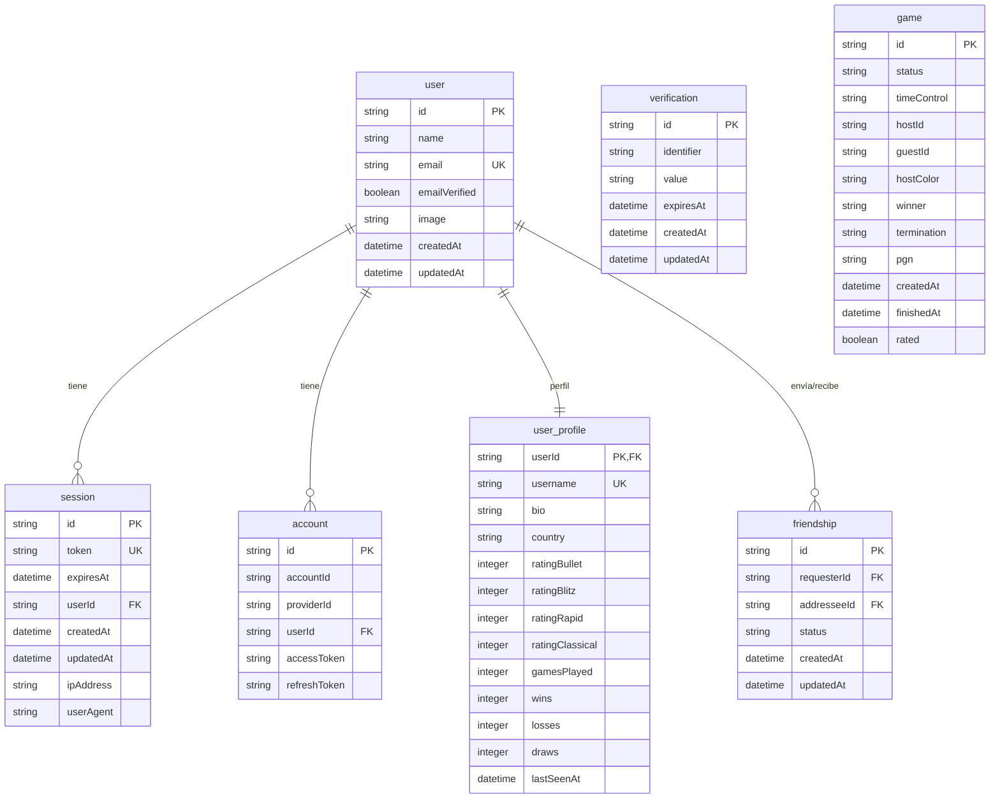

# Base de Datos

Este documento describe el esquema de la base de datos SQLite y su arquitectura definida en el paquete `@chess-fw/db`.

## Conexión
- **Driver:** `better-sqlite3`
- **ORM:** `drizzle-orm`
- **Modo:** WAL (Write-Ahead Logging) para mejor rendimiento y concurrencia.
- **Ubicación:** Variable de entorno `DATABASE_URL` (definida en `.env`).

## Diagrama de Entidad-Relación (ER)

## Tablas (8 en total)

### Tablas de Autenticación (Better Auth)

**1. `user`**
- `id` (PK)
- `name` 
- `email` (unique)
- `emailVerified`
- `image`
- `createdAt`
- `updatedAt`

**2. `session`**
- `id` (PK)
- `token` (unique)
- `expiresAt`
- `userId` (FK -> `user`)
- `createdAt`
- `updatedAt`
- `ipAddress`
- `userAgent`
- **Índices:** `session_userId_idx`

**3. `account`**
- `id` (PK)
- `accountId`
- `providerId`
- `userId` (FK -> `user`)
- `accessToken`
- `refreshToken`
- **Índices:** `account_userId_idx`

**4. `verification`**
- `id` (PK)
- `identifier`
- `value`
- `expiresAt`
- `createdAt`
- `updatedAt`

### Tabla de Partidas (Game)

**5. `game`**
Contiene toda la información histórica de una partida jugada. 
*Nota: La capacidad de reconstruir la partida completa se logra gracias a la columna `pgn`, la cual almacena todos los movimientos y metadatos en notación portátil estándar de ajedrez.*

*(Nota de implementación: se listan 23 columnas que capturan desde el estado, tiempos, jugadores, resultado, `pgn`, etc.)*
- `id` (PK)
- `status`
- `timeControl`
- `whitePlayerId` (FK)
- `blackPlayerId` (FK)
- `whitePlayerName`
- `blackPlayerName`
- `whiteRating`
- `blackRating`
- `winner` ('w'|'b'|'draw'|null)
- `reason` (razón de finalización)
- `pgn` (Notación Portátil de Partida)
- `fen`
- `speed`
- `rated`
- `createdAt`
- `startedAt`
- `finishedAt`
- `initialTime`
- `incrementTime`
- `whiteTimeLeft`
- `blackTimeLeft`
- `roomId`

### Tablas Sociales

**6. `user_profile`**
- `userId` (PK, FK -> `user`)
- `username` (unique)
- `bio`
- `country`
- `ratingBullet` (por defecto 1500)
- `ratingBlitz` (por defecto 1500)
- `ratingRapid` (por defecto 1500)
- `ratingClassical` (por defecto 1500)
- `gamesPlayed` (por defecto 0)
- `wins` (por defecto 0)
- `losses` (por defecto 0)
- `draws` (por defecto 0)
- `lastSeenAt`

**7. `friendship`**
- `id` (PK)
- `requesterId` (FK -> `user`)
- `addresseeId` (FK -> `user`)
- `status` ('pending' | 'accepted' | 'blocked')
- `createdAt`
- `updatedAt`
- **Índices:** `requester_idx`, `addressee_idx`

*(La octava tabla está gestionada por drizzle para las migraciones, por ejemplo, drizzle_migrations).*

## Migraciones

- **Herramienta:** `drizzle-kit`
- **Archivo de Configuración:** `drizzle.config.ts`
- **Generar Migraciones:** `pnpm drizzle-kit generate`
- **Aplicar Migraciones:** `pnpm drizzle-kit migrate`
- **Directorio de Artefactos:** `drizzle/`
