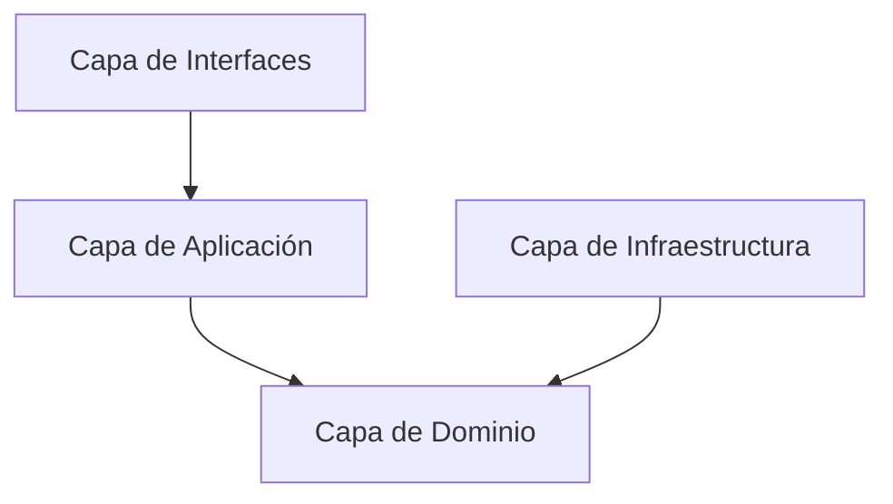

# Documentación del Servidor de Ajedrez

## Visión General
El servidor de ajedrez está construido sobre **Express** y **Socket.IO** para la comunicación en tiempo real. Utiliza **Better Auth** para la gestión de autenticación, integra **Stockfish** para el análisis y los bots, y sigue los principios de la **Clean Architecture** (Arquitectura Limpia).

## Arquitectura



## Árbol de Archivos

```text
apps/server/
├── index.ts                                        # Bootstrap
├── src/
│   ├── application/
│   │   └── GamePersistenceService.ts
│   ├── config/
│   │   ├── env.ts
│   │   └── cors.ts
│   ├── domain/
│   │   ├── entities/
│   │   │   ├── GameEntity.ts
│   │   │   └── RoomEntity.ts
│   │   ├── services/
│   │   │   ├── ClockService.ts
│   │   │   ├── MatchmakingService.ts
│   │   │   ├── RatingCalculator.ts
│   │   │   └── RoomManager.ts
│   │   └── ports/
│   │       ├── GameRepository.port.ts
│   │       └── UserRepository.port.ts
│   ├── infrastructure/
│   │   ├── auth/setup.ts
│   │   ├── db/connection.ts
│   │   ├── repositories/
│   │   │   ├── DrizzleFriendshipRepository.ts
│   │   │   ├── DrizzleGameRepository.ts
│   │   │   └── DrizzleUserRepository.ts
│   │   └── stockfish/StockfishService.ts
│   └── interfaces/
│       ├── http/
│       │   ├── game.routes.ts
│       │   ├── leaderboard.routes.ts
│       │   ├── lobby.routes.ts
│       │   ├── middleware.ts
│       │   ├── profile.routes.ts
│       │   └── social.routes.ts
│       └── socket/
│           ├── bot.handler.ts
│           ├── connection.handler.ts
│           ├── game.handler.ts
│           ├── lobby.handler.ts
│           ├── matchmaking.handler.ts
│           ├── rematch.handler.ts
│           └── room.handler.ts
```

## Guía de Inicio

Para levantar el servidor localmente:

1. **Variables de Entorno**: Crea un archivo `.env` en la raíz del servidor (`apps/server/`) basándote en el siguiente ejemplo:

```env
DATABASE_URL=local.db
SERVER_URL=http://localhost:3001
FRONTEND_URL=http://localhost:5173
BETTER_AUTH_SECRET=your-secret-key
GOOGLE_CLIENT_ID=optional
GOOGLE_CLIENT_SECRET=optional
```

2. **Instalación de Dependencias**:
```bash
pnpm install
```

3. **Ejecutar en modo Desarrollo**:
```bash
pnpm dev
```

## Paquetes Utilizados
- `@chess-fw/core`: Motor de ajedrez principal.
- `@chess-fw/db`: Esquemas y configuración de la base de datos.
- `@chess-fw/contracts`: Tipos e interfaces compartidas entre frontend y backend.

## Documentación Adicional
- [Capa de Dominio](domain.md)
- [Capa de Infraestructura](infrastructure.md)
- [Persistencia de Partidas](persistence.md)
- [API REST](api-rest.md)
- [WebSockets](sockets.md)
- [Base de Datos](database.md)
