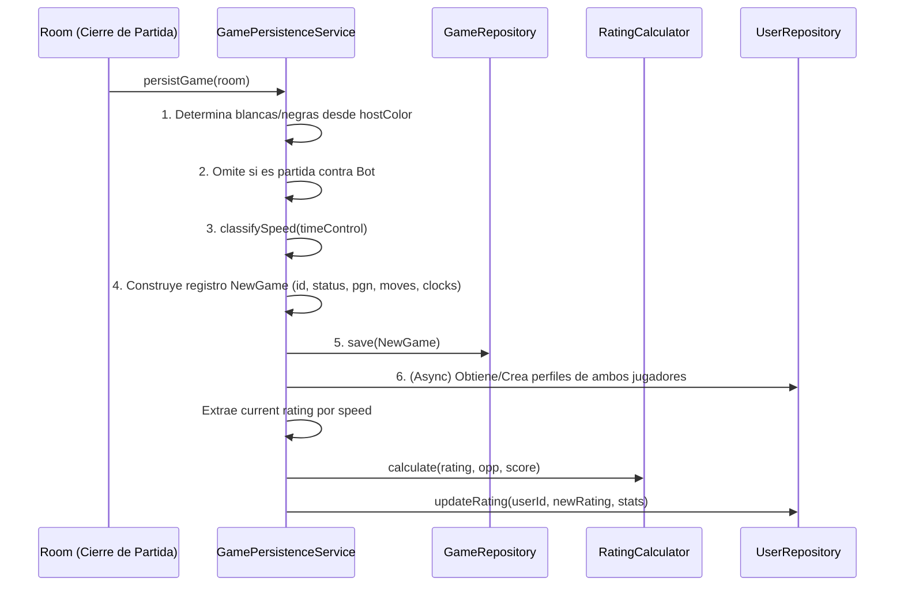

# Persistencia de Partidas

La persistencia de una partida completada es manejada por la capa de aplicación, específicamente en el `GamePersistenceService`.

## Flujo de Persistencia

## Funciones Auxiliares
- `classifySpeed(initial: number, increment: number): string`: Categoriza la velocidad de la partida (basado en la fórmula matemática de Lichess).
- `mapTermination(reason: string): string`: Convierte la razón de fin de juego (ej. mate, tiempo) al formato almacenado en base de datos.
- `mapStatus(reason: string, winner: string): string`: Mapea a un estado general para la DB.
- `getRatingForSpeed(profile: UserProfile, speed: string): number`: Extrae de manera dinámica la columna correcta de rating (ej. `rapidRating`, `blitzRating`) según la velocidad.

## Tabla de Clasificación de Velocidad (Speed)
La clasificación se determina asumiendo una partida promedio de 40 movimientos. La fórmula base es: `Tiempo Total = inicial + (40 * incremento)`.

| Tiempo Total (Segundos) | Categoría (Speed) |
| :---------------------- | :---------------- |
| < 30s                   | `ultraBullet`     |
| < 180s                  | `bullet`          |
| < 480s                  | `blitz`           |
| < 1500s                 | `rapid`           |
| >= 1500s                | `classical`       |
