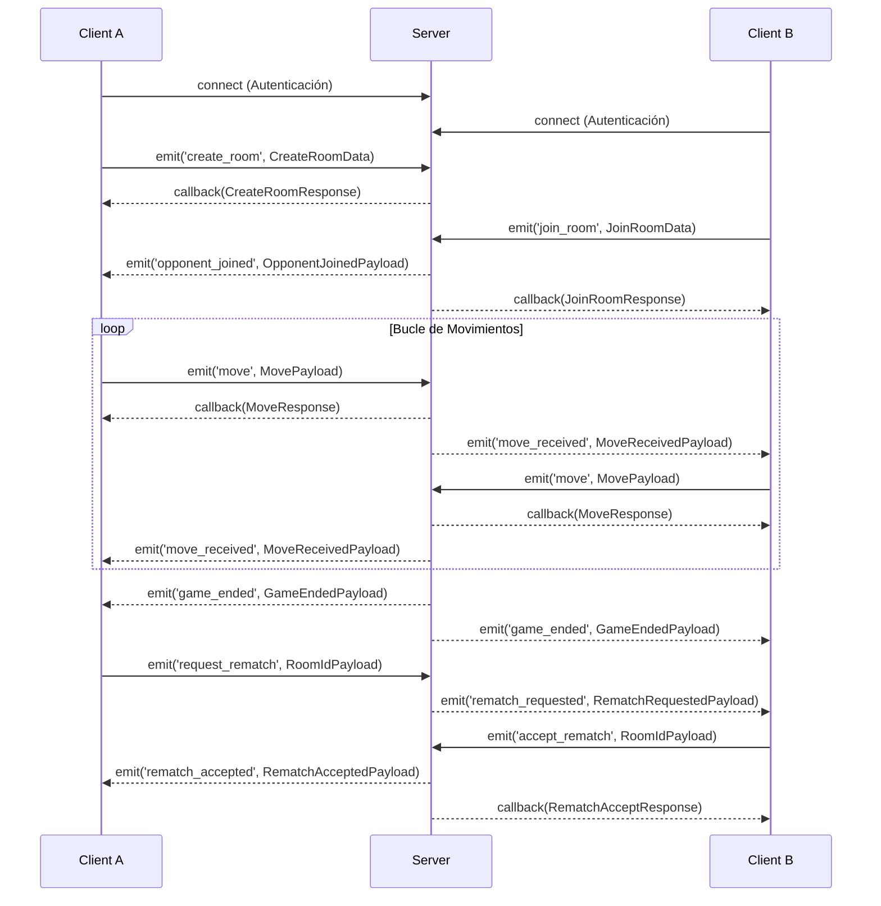

# Eventos Socket.IO

Este documento detalla todos los eventos de Socket.IO utilizados en el servidor, integrando los tipos definidos en `@chess-fw/contracts`.

## 1. Conexión y Autenticación

El servidor valida la sesión mediante Better Auth al momento de la conexión inicial del cliente.
- Las propiedades `socket.data.user` y `socket.data.session` se pueblan automáticamente si la sesión es válida.
- Por razones de compatibilidad (backwards compat), se permiten las conexiones no autenticadas (invitados).

## 2. Eventos Cliente → Servidor (14 eventos)

A continuación, los eventos emitidos por el cliente hacia el servidor y sus respectivos callbacks de respuesta (Acknowledgements).

### Sala (Room)

**1. `create_room`**
- **Data (Payload):** `CreateRoomData { hostColor, timeControl?, playerName?, playerAvatar?, playerId? }`
- **Callback de Respuesta:** `CreateRoomResponse { success, roomId?, color?, fen? }`

**2. `join_room`**
- **Data (Payload):** `JoinRoomData { roomId, playerId?, playerName?, playerAvatar? }`
- **Callback de Respuesta:** `JoinRoomResponse { success, ...RoomSnapshot, color?, waiting? }`

### Partida (Game)

**3. `move`**
- **Data (Payload):** `MovePayload { roomId, moveData: { from, to, promotion? } }`
- **Callback de Respuesta:** `MoveResponse { success, players?, turn?, lastMoveTime? }`

**4. `game_over`**
- **Data (Payload):** `GameOverData { roomId, result: { winner, reason } }`
- **Callback de Respuesta:** `SocketAck`

### Emparejamiento (Matchmaking)

**5. `find_match`**
- **Data (Payload):** `FindMatchData { timeControl, rating?, preferredColor? }`
- **Callback de Respuesta:** `FindMatchResponse { success, matched?, message?, queueStats? }`

**6. `cancel_search`**
- **Data (Payload):** `{}`
- **Callback de Respuesta:** `SocketAck`

### Lobby

**7. `get_open_rooms`**
- **Data (Payload):** `GetOpenRoomsData { speed? }`
- **Callback de Respuesta:** `GetOpenRoomsResponse { success, rooms? }`

**8. `join_lobby`**
- **Data (Payload):** `{}`
- **Descripción:** Une al cliente al canal (room) de Socket.IO llamado 'lobby'.
- **Callback de Respuesta:** `SocketAck`

**9. `leave_lobby`**
- **Data (Payload):** `{}`
- **Callback de Respuesta:** `SocketAck`

### Revancha (Rematch)

**10. `request_rematch`**
- **Data (Payload):** `RoomIdPayload { roomId }`
- **Callback de Respuesta:** `SocketAck`

**11. `accept_rematch`**
- **Data (Payload):** `RoomIdPayload`
- **Callback de Respuesta:** `RematchAcceptResponse { success, ...RoomSnapshot, hostColor?, guestColor? }`

**12. `decline_rematch`**
- **Data (Payload):** `RoomIdPayload`
- **Callback de Respuesta:** `SocketAck`

### Bots

**13. `evaluate_bot_move`**
- **Data (Payload):** `EvaluateBotData { fen, options?: { depth?, timeLimit?, skillLevel? } }`
- **Callback de Respuesta:** `BotMoveResponse { success, evaluation? }`

*(Nota: los eventos `cancel_search`, `join_lobby`, `leave_lobby`, `request_rematch` y `decline_rematch` utilizan la interfaz base de confirmación `SocketAck` si no se especifica otra forma).*

## 3. Eventos Servidor → Cliente (11 eventos)

Eventos emitidos por el servidor para notificar a los clientes sobre cambios de estado.

1. **`opponent_joined`** — `OpponentJoinedPayload { players }`
2. **`room_closed`** — (Sin payload)
3. **`move_received`** — `MoveReceivedPayload { moveData, fen, pgn, players?, turn?, lastMoveTime? }`
4. **`game_ended`** — `GameEndedPayload { result, ...RoomSnapshot }`
5. **`match_found`** — `MatchFoundPayload { color, ...RoomSnapshot }`
6. **`room_created`** — `LobbyRoom { roomId, host, hostColor, timeControl, speed, createdAt }`
7. **`room_filled`** — `RoomIdPayload { roomId }`
8. **`rematch_requested`** — `RematchRequestedPayload { requestedBy, playerName }`
9. **`rematch_accepted`** — `RematchAcceptedPayload { ...RoomSnapshot, hostColor, guestColor }`
10. **`rematch_declined`** — (Sin payload)
11. **`opponent_disconnected`** — `DisconnectPayload { hostConnected, guestConnected }`
12. **`opponent_reconnected`** — (Sin payload)

## 4. Flujo del Ciclo de Vida de la Partida

